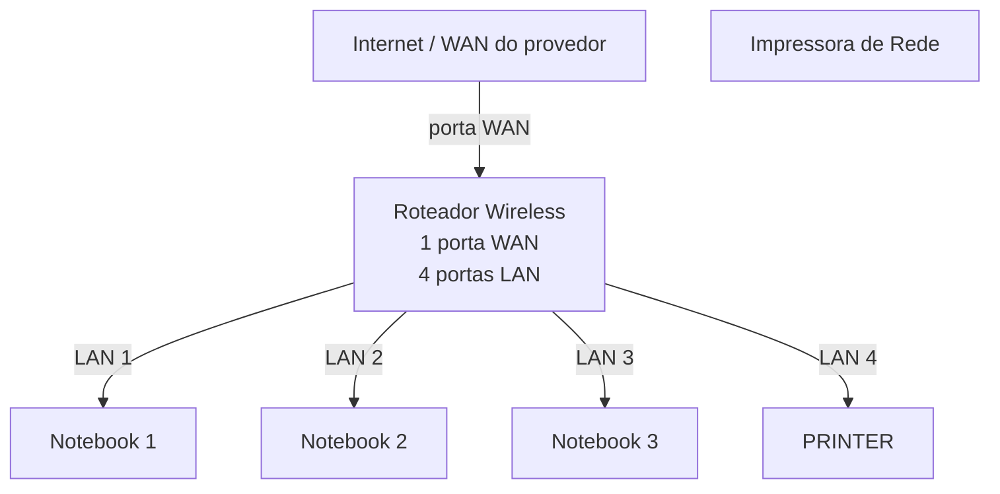

# laboratório de redes 01 - Projeto de Rede Local 
Projeto desenvolvido na Disciplina de Redes de Computadores no Curso Técnico de Informática do Senac 

Aluno: Luiza 

Professor : José De Assis 

Data : 09/03/2026

---
## 1. Objetivo
Implementar uma rede local simples conectando 3 notebooks a um roteador wireless com swich integrado a uma impressora de rede.

## O projeto será realizado em duas etapas 
1. Simulação da rede do Cisco Packet Tracer
2. Implementação da rede no laboratório real

---

## 2. Equipamentos utilizados neste laboratório 

- 3 notebooks
- 1 roteador wireless com 1 porta WAN  e 4 portas LAN
- 1 impressora de rede
- cabos de rede 

---

## 3. Topologia da Rede 
Diagrama Lógico da rede utilizada neste laboratório 

