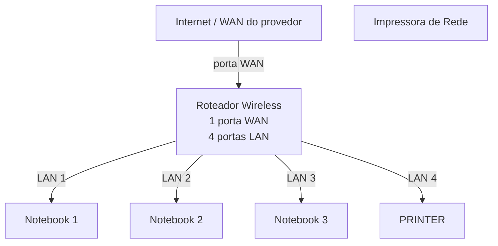
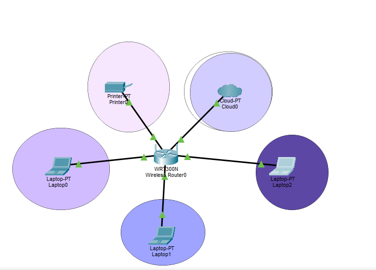

# laboratório de redes 01 - Projeto de Rede Local 
Projeto desenvolvido na Disciplina de Redes de Computadores no Curso Técnico de Informática do Senac 

Aluno: Luiza 

Professor : José De Assis 

Data : 09/03/2026

---
## 1. Objetivo
Implementar uma rede local simples conectando 3 notebooks a um roteador wireless com swich integrado a uma impressora de rede.

## O projeto será realizado em duas etapas 
1. Simulação da rede do Cisco Packet Tracer
2. Implementação da rede no laboratório real

---

## 2. Equipamentos utilizados neste laboratório 

- 3 notebooks
- 1 roteador wireless com 1 porta WAN  e 4 portas LAN
- 1 impressora de rede
- cabos de rede 

---

## 3. Topologia da Rede 
Diagrama Lógico da rede utilizada neste laboratório 

## 4. Plano de endereço IP

Rede: 192.168.0.0/24
Gateway: 192.168.0.1 

| Dispositivos | Tipo de IP | Endereço IP | Observação |
|-------------|-------------|-------------|-------------|
| Roteador | Estácio | 192.168.0.1 | IP do roteador |
| Impressora| Reserva DHCP | 192.168.0.100 | IP reservado pelo roteador | 
| PC1 | Reserva do DHCP | 192.168.0.101 | IP reservado pelo roteador |
| PC2 | DHCP | Automático | IP atribuído pelo roteador |
| PC3 | DHCP | Automático | IP atribuído pelo roteador |

##Observação##

- A impressora e um dos notebooks utilizados reserva DHCP
- O roteador sempre atribui o mesmo endereço IP a esses dispositivos

---

## 5. Implementção no laboratório Real 

Após a instalação, a rede foi montada fisicamente no laboratório 

Etapas realizadas: 

(Fotos)

Testes: 

(Fotos) 

---

## 6. Conclusão 

Este laboratório permitiu compreender o funcionamento  de uma rede local simples, incluindo:

- Estrutura de uma rede doméstica ou de pequeno escritório 
- Utilização de um roteador com porta WAN e portas LAN
- Funcionamento do DHCP
- Comunicação entre dispositivos na rede local
- Utilização de uma impressora de rede
- Compartilhamento de pastas na rede
